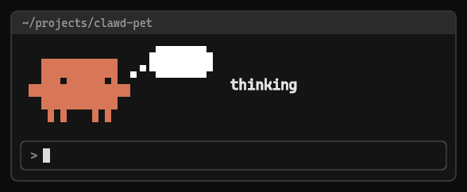
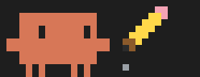
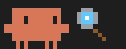

# Clawd Pet

Clawd, the Claude Code mascot, lives in the band above your prompt and acts out what Claude is doing. When you run several sessions side by side, a glance tells you which one is working, which one needs you, and which one is done.



This is an unofficial fan project, not affiliated with or endorsed by Anthropic.

| Claude is... | Clawd... | Looks like |
| --- | --- | --- |
| Idle | Breathes, blinks, and looks around. |  |
| Idle for a minute | Falls asleep, with Z's rising. |  |
| Thinking | Looks up beside a thought bubble. |  |
| Reading a file | Hops beside a book, eyes moving across the lines, and turns the page. |  |
| Editing a file | Hops while a pencil writes. |  |
| Searching | Hops while a magnifier circles, as if scanning a page. |  |
| Running a command | Hops beside a rocket as stars stream past it. |  |
| Browsing the web | Hops beside a browser window as a page loads. |  |
| Running a subagent | Brings a small helper Clawd. |  |
| Waiting for you | Waves beside a bouncing "?" while Claude asks you a question or a permission prompt is open, with what Claude wants to run under "needs you". After you approve a long command, Clawd goes back to work once the command starts running. |  |
| Running tests or a build that passes | Hops with happy eyes as a green check draws itself. |  |
| Running tests or a build that fails | Squashes down with closed eyes beside a red X. |  |
| Making a git commit | Cheers with "committed!" and the commit message. |  |
| Done with a turn | Jumps with happy eyes as confetti falls. |  |
| Hitting an error | Shows X eyes, a sweat drop, and a red "!". |  |
| Stopped by your plan's usage limit | Sleeps, with "resting" and the time the limit resets. |  |

## What Clawd is working on

Under the mood name, a dim line says what Claude is working on:

- The file name, when Claude reads or edits a file, such as `register.tsx`.
- The search pattern or web query, when Claude searches.
- A command's own description, when Claude runs a command, such as `Run the unit tests`. Without a description, the command itself, with any leading `cd … &&` left off.

The line is cut at 30 characters to keep the band calm.

## Time of day

Clawd follows your computer's local time:

- From midnight to 6 a.m., Clawd wears a striped nightcap in every mood.
- From 6 to 11 a.m., an idle Clawd has a steaming mug of coffee beside it. When the context battery is showing, the battery takes its place.

 

## Test and build results

Clawd reacts for 3 seconds when Claude runs a check: tests, a build, a type check, or a linter.

- A command counts as a check when it starts with a test or build tool, such as `npm test`, `pnpm run build`, `npx vitest`, `pytest`, `uv run pytest`, `go test`, `cargo build`, `tsc`, `eslint`, `make`, or `claude plugin test`. Options before the tool, such as `npx -p typescript tsc`, and settings before the command, such as `CI=1 npm test`, are fine. Steps after `&&`, `;`, or `|` count too. A command that only mentions a word, such as `git commit -m "add test"`, doesn't.
- A check fails when the command exits with an error, or its output shows a failure count above zero ("2 failed") or `FAIL`. Otherwise it passes.
- When a check is the last thing in a turn, Clawd keeps showing its result for 3 seconds after the turn ends, instead of the "done!" cheer.

## Context battery

Clawd shows how full the context window is, so you know when to run `/compact`.

- When the context is 50% full or more, a battery appears beside Clawd every time Clawd is idle or asleep. The battery drains as the context fills: green, then yellow from 65%, then red from 80%.

  

- While Claude works, Clawd holds the prop for its task instead. The battery comes back each time Claude finishes.
- A "context N%" line in the same color shows under the mood name in every mood.
- At 80%, a toast tells you once to run `/compact`.
- The battery and the line go away when the context drops below 50%, for example after `/compact`.

Claude Code measures the context after each turn, so a new or just-compacted session shows nothing until its next turn ends.

## Plan usage limits

On a Claude subscription, Clawd watches your 5-hour and weekly usage limits:

- When a limit passes 90%, a toast tells you once, with the time it resets.
- When a limit stops Claude mid-task, Clawd sleeps with "resting" and the reset time, such as `until 3:40 PM`. Clawd wakes up when the limit resets, or when you send a new prompt.

With an API key, Claude Code reports no limits, and Clawd shows neither.

## Requirements

- Claude Code in the terminal (tested on 2.1.292). The desktop app doesn't draw the pet.
- A terminal with 24-bit color and a font that has block characters, such as Windows Terminal, iTerm2, kitty, or Ghostty.

## Install

```bash
claude plugin marketplace add iamphduc/clawd-pet
claude plugin install pet@clawd-pet
```

Then start a new session or run `/reload-plugins`.

## Update

```bash
claude plugin marketplace update clawd-pet
claude plugin update pet@clawd-pet
```

Then start a new session or run `/reload-plugins`.

## Use

Clawd reacts on its own. To preview a mood, run `/pet <mood> [seconds]`:

```text
/pet happy
/pet helper 5
/pet
```

`/pet` with no mood lists them all.

To watch every mood in turn, run `/pet demo`. Each mood shows for 2 seconds. When Claude starts working, the demo stops.

To preview the battery, set a fake context fill with `/pet context <percent>`, such as `/pet context 72`. Your next prompt replaces it with the real value.

To preview the time of day, fake the hour for 10 seconds with `/pet hour <0-23>`, such as `/pet hour 8`.

To turn Clawd off while you focus, run `/pet off`. Clawd stays off in new sessions too, until you run `/pet on`. The context toast at 80% and the plan-limit toast at 90% still show while Clawd is off.

To collapse the band for now, press `ctrl+x ctrl+a` or click `[-]`.

## Develop

The pet is a hooks-module plugin in `plugins/pet`:

- `hooks/register.tsx` turns turn and tool events into moods and draws the band.
- `hooks/sprites.ts` holds the pixel art. Each terminal cell draws 2 x 2 pixels with quarter-block characters. Before you change the art, read [docs/decisions.md](docs/decisions.md).
- `tests/pet.test.ts` holds the tests.
- `scripts/render-moods.mjs` renders the animated mood images in `docs/moods/` from the sprite code. After you change the art, run `node scripts/render-moods.mjs` to update them.

To load your working copy in one session:

```bash
claude --plugin-dir ./plugins/pet
```

Loading the plugin this way also writes the plugin API's types to `plugins/pet/.claude-plugin/types/`. That folder is gitignored, because Claude Code writes it to match your installed version. Until you load the plugin once, your editor reports false errors such as "Cannot find module 'claude-code'".

To check your changes:

```bash
claude plugin validate ./plugins/pet
claude plugin test ./plugins/pet
npx -p typescript tsc -p ./plugins/pet
```

## Uninstall

```bash
claude plugin uninstall pet@clawd-pet
```
